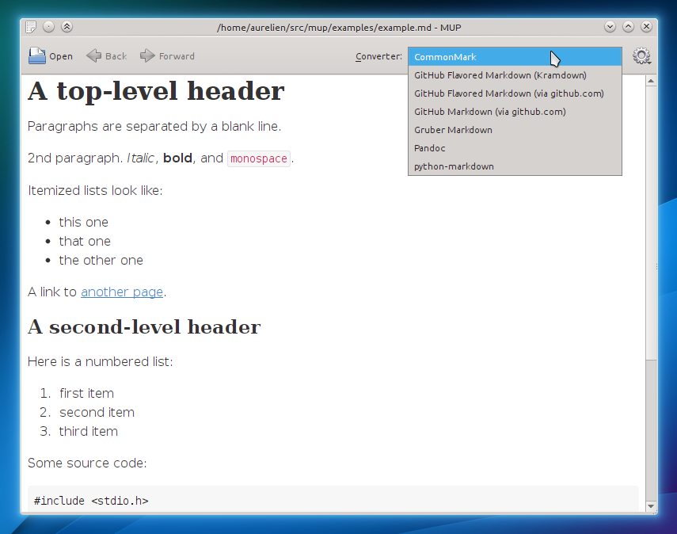

# MUP: a Markup Previewer

MUP is a markup previewer. It supports multiple markup formats. You can use it
to read markup text, but it is also useful when writing markup text to check
how your work looks, thanks to its refresh-as-you-save feature.

## Features

- Supports multiple markup formats, easy to extend
- Automatically refreshes itself when the document is modified, tries to retain
  the position in the document after refreshing
- Skips metadata headers, such as those used by static blog generators like
  Jekyll
- Supports gzipped documents, useful to read documentation shipped with Debian
  packages
- Comes with a wrapper for man pages

## Supported Formats

MUP supports Markdown and reStructuredText using Python modules.

It also supports the following formats using external converters:

- Markdown
- GitHub Flavored Markdown
- Ronn
- Man pages
- Asciidoc

External converters are command line tools which are invoked by MUP to convert
input files. To be used as an external converter, the tool must accept markup
on stdin and produce HTML on stdout.

## Usage

Start MUP like this:

    mup markup_file

To read a man page with mup:

    mupman ls

Or:

    mupman 5 crontab

## Requirements

Mup requires Python 3 and the following Python modules:

- [PyQt5][], including PyQt5 WebKit, which can be in a separate package
- [PyYAML][]
- [PyXDG][]

It can make use of other Python modules and external tools to render various
markup formats.

[PyQt5]: https://www.riverbankcomputing.com/software/pyqt/download5
[PyYAML]: http://pyyaml.org/wiki/PyYAML
[PyXDG]: https://freedesktop.org/wiki/Software/pyxdg/

### Markdown

For Markdown you need to install one of these:

- Python [Markdown][python-markdown] module
- [Pandoc][]
- [CommonMark][]
- [Gruber Markdown][Gruber]
- Python [Requests][requests] module: to render Markdown using GitHub Rest API
  (slow but accurate)

### GitHub Flavored Markdown (GFM)

For GitHub Flavored Markdown (Markdown which takes newlines into account) you
need to install one of these:

- [kramdown][]
- Python [Requests][requests] module: to render GFM using GitHub Rest API (slow
  but accurate)

### reStructuredText

For reStructuredText you need to install the [docutils][] Python module.

### Man pages

For man pages you need to install [Groff][] (but it is already installed on
most Linux distributions).

### Ronn

For Ronn you need to install [Ronn][].

### Asciidoc

For Asciidoc you need to install [Asciidoc][].

[python-markdown]: https://pythonhosted.org/Markdown/
[Pandoc]: http://pandoc.org
[kramdown]: http://kramdown.gettalong.org/
[CommonMark]: http://commonmark.org
[Gruber]: http://daringfireball.net/projects/markdown/

[docutils]: http://docutils.sourceforge.net/

[Groff]: https://www.gnu.org/software/groff/

[Ronn]: https://www.mankier.com/1/ronn
[Asciidoc]: http://www.methods.co.nz/asciidoc/
[Requests]: http://python-requests.org

## Installation

Run `./setup.py install` as root.

## Editing files

You can edit the current file by clicking on the menu button then select "Open
with Editor". This will open the file in the configured editor.

To configure which editor should be used, edit `~/.config/mup/mup.yaml` and add
the following content:

    editor: name-of-your-editor

Note: for now you cannot define arguments for the editor. If you need arguments
you will have to write a wrapper shell script.

## Defining a new Converter

To declare the `foo2html` command as a converter for .foo or .foobar files,
create a `foo.yaml` file in `/usr/share/mup/converters` or in
`~/.local/share/mup/converters` with the following content:

    name: Foo
    cmd: foo2html
    matches: ["*.foo", "*.foobar"]

If MUP can find the `foo2html` binary, it will use it whenever it tries to open
a .foo file.

Other optional keys:

- `args`: Arguments to pass to the command
- `full`: Set to true if the command creates a complete HTML document, not just
  an HTML snippet (defaults to false)
- `online`: Set to true if the converter uses an online service. Those are
  slower than offline ones and are thus not selected by default
- `reference`: Set to true if the converter is the reference implementation for
  the format it handles. A reference converter will be selected by default if
  available

## Contributing

MUP is managed using the [lightweight project management policy][lpmp].

Get the code from `https://github.com/agateau/mup` then file pull requests
against the `dev` branch.

[lpmp]: http://agateau.com/2014/lightweight-project-management

## Author

Aurélien Gâteau

## License

BSD
